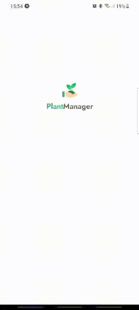

<h1 align="center">
    
</h1>

## 🧪 Tecnologias no projeto

Este projeto foi desenvolvido com as seguintes tecnologias:

- [React Native](https://reactnative.dev/)
- [Expo](https://expo.io/)
- [TypeScript](https://www.typescriptlang.org/)

## 🚀 Iniciando

Clonar e acessar a pasta do projeto

```bash
$ git clone https://github.com/dougborbabass/PlantManager.git && cd plantManager
```

Siga os passos abaixo

### Instalando as dependencias
```bash
$ yarn install
```

#### instalando Json-server
```bash
$ yarn add -g json-server
```

### Subindo a api localmente das plantas
```bash
$ json-server ./src/services/server.json --host 192.168.0.2 --port 3333
```

⚠️ Lembre de alterar para o ip de seu localhost

💡 Você pode adicionar um --delay 1000 por exemplo para simular um carregamento e poder ver as animações de loading


### trocando a url base no seu projeto para direcionar para sua api local
```javascript
const api = axios.create({
    baseURL: 'http://192.168.0.2:3333'
})
```

### Start do projeto
```bash
$ expo start
```

### 💻 Projeto

Projeto para você lembrar de sempre regar suas plantas 🌱



